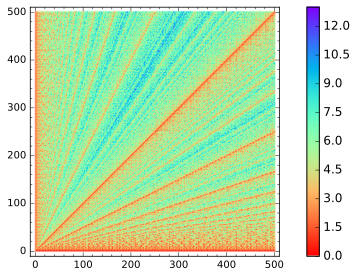
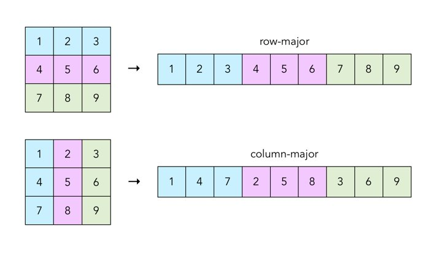
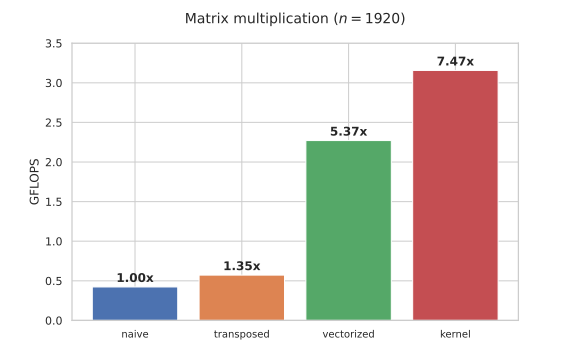
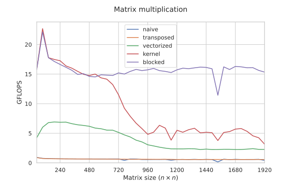
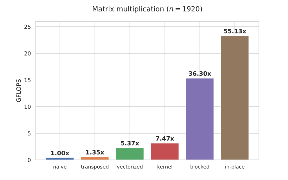
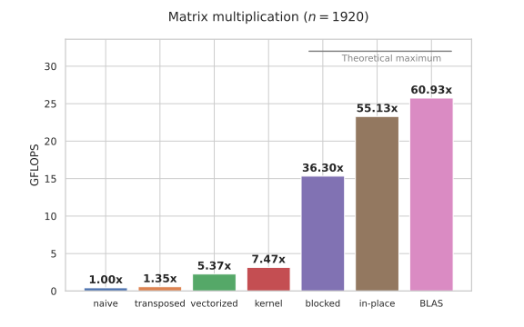
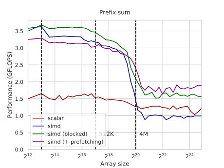
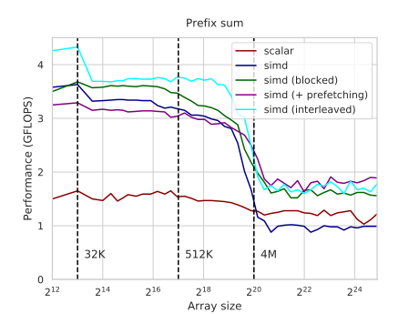
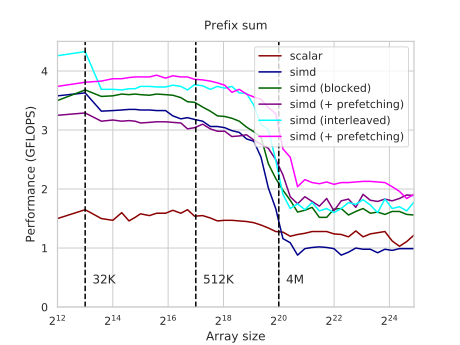

# _index ---
title: Algorithms Case Studies
weight: 11
---

When you try to explain a complex concept, it is generally a good idea to give a very simple and minimal example illustrating it. This is why in this book you see about a dozen different ways of calculating the sum of an array, each highlighting a certain CPU feature.

But the main purpose of this book is not to learn computer architecture just for the sake of learning it, but to acquire real-world skills in software optimization. The next two chapters exist to help you achieve this goal, as they contain detailed case studies of various algorithms that are much harder to optimize than the sum of an array.

<!--

To achieve this goal, 

it is filled with — and, in fact, mostly comprised of — examples of algorithms that are harder to optimize than the sum of an array.

To achieve this goal, it is filled with — and, in fact, mostly comprised of — examples of algorithms that are harder to optimize than the sum of an array.

This and the next chapter is the scientifically valuable part of the book.

-->
 --- # argmin ---
title: Argmin with SIMD
weight: 7
---

Computing the *minimum* of an array is [easily vectorizable](/hpc/simd/reduction), as it is not different from any other reduction: in AVX2, you just need to use a convenient `_mm256_min_epi32` intrinsic as the inner operation. It computes the minimum of two 8-element vectors in one cycle — even faster than in the scalar case, which requires at least a comparison and a conditional move.

Finding the *index* of that minimum element (*argmin*) is much harder, but it is still possible to vectorize very efficiently. In this section, we design an algorithm that computes the argmin (almost) at the speed of computing the minimum and ~15x faster than the naive scalar approach.

### Scalar Baseline

For our benchmark, we create an array of random 32-bit integers, and then repeatedly try to find the index of the minimum among them (the first one if it isn't unique):

```c++
const int N = (1 << 16);
alignas(32) int a[N];

for (int i = 0; i < N; i++)
    a[i] = rand();
```

For the sake of exposition, we assume that $N$ is a power of two, and run all our experiments for $N=2^{13}$ so that the [memory bandwidth](/hpc/cpu-cache/bandwidth) is not a concern.

To implement argmin in the scalar case, we just need to maintain the index instead of the minimum value:

```c++
int argmin(int *a, int n) {
    int k = 0;

    for (int i = 0; i < n; i++)
        if (a[i] < a[k])
            k = i;
    
    return k;
}
```

It works at around 1.5 GFLOPS — meaning $1.5 \cdot 10^9$ values per second  processed on average, or about 0.75 values per cycle (the CPU is clocked at 2GHz).

Let's compare it to `std::min_element`:

```c++
int argmin(int *a, int n) {
    int k = std::min_element(a, a + n) - a;
    return k;
}
```

<!--

https://github.com/llvm-mirror/libcxx/blob/78d6a7767ed57b50122a161b91f59f19c9bd0d19/include/algorithm#L2489

https://github.com/gcc-mirror/gcc/blob/16e2427f50c208dfe07d07f18009969502c25dc8/libstdc%2B%2B-v3/include/bits/stl_algo.h#L5606

```nasm
lea	r8, 24[rdx]	# __first,
mov	r11d, DWORD PTR [rax]
cmp	DWORD PTR 12[rdx], r11d
cmovl	rax, r10	# __result,, __result, __first
```

```nasm
cmp	eax, r12d	# prephitmp_103, _108	
jle	.L36	#,	
mov	eax, r12d	# prephitmp_103, _108	
mov	ecx, ebp	# k, ivtmp.29	
.L36:	
lea	rdx, 4[r8]	# ivtmp.29,	
```

```nasm
cmp	eax, r12d	# prephitmp_103, _108	
jle	.L36	#,	
mov	eax, r12d	# prephitmp_103, _108	
mov	ecx, ebp	# k, ivtmp.29	
.L36:	
lea	rdx, 4[r8]	# ivtmp.29,	
```

-->

The version from GCC gives ~0.28 GFLOPS — apparently, the compiler couldn't pierce through all the abstractions. Another reminder to never use STL.

### Vector of Indices

The problem with vectorizing the scalar implementation is that there is a dependency between consequent iterations. When we optimized [array sum](/hpc/simd/reduction), we faced the same problem, and we solved it by splitting the array into 8 slices, each representing a subset of its indices with the same remainder modulo 8. We can apply the same trick here, except that we also have to take array indices into account.

When we have the consecutive elements and their indices in vectors, we can process them in parallel using [predication](/hpc/pipelining/branchless):

```c++
typedef __m256i reg;

int argmin(int *a, int n) {
    // indices on the current iteration
    reg cur = _mm256_setr_epi32(0, 1, 2, 3, 4, 5, 6, 7);
    // the current minimum for each slice
    reg min = _mm256_set1_epi32(INT_MAX);
    // its index (argmin) for each slice
    reg idx = _mm256_setzero_si256();

    for (int i = 0; i < n; i += 8) {
        // load a new SIMD block
        reg x = _mm256_load_si256((reg*) &a[i]);
        // find the slices where the minimum is updated
        reg mask = _mm256_cmpgt_epi32(min, x);
        // update the indices
        idx = _mm256_blendv_epi8(idx, cur, mask);
        // update the minimum (can also similarly use a "blend" here, but min is faster)
        min = _mm256_min_epi32(x, min);
        // update the current indices
        const reg eight = _mm256_set1_epi32(8);
        cur = _mm256_add_epi32(cur, eight);       // 
        // can also use a "blend" here, but min is faster
    }

    // find the argmin in the "min" register and return its real index

    int min_arr[8], idx_arr[8];
    
    _mm256_storeu_si256((reg*) min_arr, min);
    _mm256_storeu_si256((reg*) idx_arr, idx);

    int k = 0, m = min_arr[0];

    for (int i = 1; i < 8; i++)
        if (min_arr[i] < m)
            m = min_arr[k = i];

    return idx_arr[k];
}
```

It works at around 8-8.5 GFLOPS. There is still some inter-dependency between the iterations, so we can optimize it by considering more than 8 elements per iteration and taking advantage of the [instruction-level parallelism](/hpc/simd/reduction#instruction-level-parallelism).

This would help performance a lot, but not enough to match the speed of computing the minimum (~24 GFLOPS) because there is another bottleneck. On each iteration, we need a load-fused comparison, a load-fused minimum, a blend, and an addition — that is 4 instructions in total to process 8 elements. Since the decode width of this CPU (Zen 2) is just 4, the performance will still be limited by 8 × 2 = 16 GFLOPS even if we somehow got rid of all the other bottlenecks.

Instead, we will switch to another approach that requires fewer instructions per element.

### Branches Aren't Scary

When we run the scalar version, how often do we update the minimum?

Intuition tells us that, if all the values are drawn independently at random, then the event when the next element is less than all the previous ones shouldn't be frequent. More precisely, it equals the reciprocal of the number of processed elements. Therefore, the expected number of times the `a[i] < a[k]` condition is satisfied equals the sum of the harmonic series:

$$
\frac{1}{2} + \frac{1}{3} + \frac{1}{4} + \ldots + \frac{1}{n} = O(\ln(n))
$$

So the minimum is updated around 5 times for a hundred-element array, 7 for a thousand-element, and just 14 for a million-element array — which isn't large at all when looked at as a fraction of all is-new-minimum checks.

The compiler probably couldn't figure it out on its own, so let's [explicitly provide](/hpc/compilation/situational) this information:

```c++
int argmin(int *a, int n) {
    int k = 0;

    for (int i = 0; i < n; i++)
        if (a[i] < a[k]) [[unlikely]]
            k = i;
    
    return k;
}
```

The compiler [optimized the machine code layout](/hpc/architecture/layout), and the CPU is now able to execute the loop at around 2 GFLOPS — a slight but sizeable improvement from 1.5 GFLOPS of the non-hinted loop.

Here is the idea: if we are only updating the minimum a dozen or so times during the entire computation, we can ditch all the vector-blending and index updating and just maintain the minimum and regularly check if it has changed. Inside this check, we can use however slow method of updating the argmin we want because it will only be called a few times.

To implement it with SIMD, all we need to do on each iteration is a vector load, a comparison, and a test-if-zero:

```c++
int argmin(int *a, int n) {
    int min = INT_MAX, idx = 0;
    
    reg p = _mm256_set1_epi32(min);

    for (int i = 0; i < n; i += 8) {
        reg y = _mm256_load_si256((reg*) &a[i]); 
        reg mask = _mm256_cmpgt_epi32(p, y);
        if (!_mm256_testz_si256(mask, mask)) { [[unlikely]]
            for (int j = i; j < i + 8; j++)
                if (a[j] < min)
                    min = a[idx = j];
            p = _mm256_set1_epi32(min);
        }
    }
    
    return idx;
}
```

It already performs at ~8.5 GFLOPS, but now the loop is bottlenecked by the `testz` instruction which only has a throughput of one. The solution is to load two consecutive SIMD blocks and use the minimum of them so that the `testz` effectively processes 16 elements in one go:

```c++
int argmin(int *a, int n) {
    int min = INT_MAX, idx = 0;
    
    reg p = _mm256_set1_epi32(min);

    for (int i = 0; i < n; i += 16) {
        reg y1 = _mm256_load_si256((reg*) &a[i]);
        reg y2 = _mm256_load_si256((reg*) &a[i + 8]);
        reg y = _mm256_min_epi32(y1, y2);
        reg mask = _mm256_cmpgt_epi32(p, y);
        if (!_mm256_testz_si256(mask, mask)) { [[unlikely]]
            for (int j = i; j < i + 16; j++)
                if (a[j] < min)
                    min = a[idx = j];
            p = _mm256_set1_epi32(min);
        }
    }
    
    return idx;
}
```

This version works in ~10 GFLOPS. To remove the other obstacles, we can do two things:

- Increase the block size to 32 elements to allow for more instruction-level parallelism.
- Optimize the local argmin: instead of calculating its exact location, we can just save the index of the block and then come back at the end and find it just once. This lets us only compute the minimum on each positive check and broadcast it to a vector, which is simpler and much faster.

With these two optimizations implemented, the performance increases to a whopping ~22 GFLOPS:

```c++
int argmin(int *a, int n) {
    int min = INT_MAX, idx = 0;
    
    reg p = _mm256_set1_epi32(min);

    for (int i = 0; i < n; i += 32) {
        reg y1 = _mm256_load_si256((reg*) &a[i]);
        reg y2 = _mm256_load_si256((reg*) &a[i + 8]);
        reg y3 = _mm256_load_si256((reg*) &a[i + 16]);
        reg y4 = _mm256_load_si256((reg*) &a[i + 24]);
        y1 = _mm256_min_epi32(y1, y2);
        y3 = _mm256_min_epi32(y3, y4);
        y1 = _mm256_min_epi32(y1, y3);
        reg mask = _mm256_cmpgt_epi32(p, y1);
        if (!_mm256_testz_si256(mask, mask)) { [[unlikely]]
            idx = i;
            for (int j = i; j < i + 32; j++)
                min = (a[j] < min ? a[j] : min);
            p = _mm256_set1_epi32(min);
        }
    }

    for (int i = idx; i < idx + 31; i++)
        if (a[i] == min)
            return i;
    
    return idx + 31;
}
```

This is almost as high as it can get as just computing the minimum itself works at around 24-25 GFLOPS.

The only problem of all these branch-happy SIMD implementations is that they rely on the minimum being updated very infrequently. This is true for random input distributions, but not in the worst case. If we fill the array with a sequence of decreasing numbers, the performance of the last implementation drops to about 2.7 GFLOPS — almost 10 times as slow (although still faster than the scalar code because we only calculate the minimum on each block).

One way to fix this is to do the same thing that the quicksort-like randomized algorithms do: just shuffle the input yourself and iterate over the array in random order. This lets you avoid this worst-case penalty, but it is tricky to implement due to RNG- and [memory](/hpc/cpu-cache/prefetching)-related issues. There is a simpler solution.

### Find the Minimum, Then Find the Index

We know how to [calculate the minimum of an array](/hpc/simd/reduction) fast and how to [find an element in an array](/hpc/simd/masking#searching) fast — so why don't we just separately compute the minimum and then find it?

```c++
int argmin(int *a, int n) {
    int needle = min(a, n);
    int idx = find(a, n, needle);
    return idx;
}
```

If we implement the two subroutines optimally (check the linked articles), the performance will be ~18 GFLOPS for random arrays and ~12 GFLOPS for decreasing arrays — which makes sense as we are expected to read the array 1.5 and 2 times respectively. This isn't that bad by itself — at least we avoid the 10x worst-case performance penalty — but the problem is that this penalized performance also translates to larger arrays, when we are bottlenecked by the [memory bandwidth](/hpc/cpu-cache/bandwidth) rather than compute.

Luckily, we already know how to fix it. We can split the array into blocks of fixed size $B$ and compute the minima on these blocks while also maintaining the global minimum. When the minimum on a new block is lower than the global minimum, we update it and also remember the block number of where the global minimum currently is. After we've processed the entire array, we just return to that block and scan through its $B$ elements to find the argmin.

This way we only process $(N + B)$ elements and don't have to sacrifice neither ½ nor ⅓ of the performance:

```c++
const int B = 256;

// returns the minimum and its first block
pair<int, int> approx_argmin(int *a, int n) {
    int res = INT_MAX, idx = 0;
    for (int i = 0; i < n; i += B) {
        int val = min(a + i, B);
        if (val < res) {
            res = val;
            idx = i;
        }
    }
    return {res, idx};
}

int argmin(int *a, int n) {
    auto [needle, base] = approx_argmin(a, n);
    int idx = find(a + base, B, needle);
    return base + idx;
}
```

This results for the final implementation are ~22 and ~19 GFLOPS for random and decreasing arrays respectively.

The full implementation, including both `min()` and `find()`, is about 100 lines long. [Take a look](https://github.com/sslotin/amh-code/blob/main/argmin/combined.cc) if you want, although it is still far from being production-grade.

### Summary

Here are the results combined for all implementations:

```
algorithm    rand   decr   reason for the performance difference
-----------  -----  -----  -------------------------------------------------------------
std          0.28   0.28   
scalar       1.54   1.89   efficient branch prediction
+ hinted     1.95   0.75   wrong hint
index        8.17   8.12
simd         8.51   1.65   scalar-based argmin on each iteration
+ ilp        10.22  1.74   ^ same
+ optimized  22.44  2.70   ^ same, but faster because there are less inter-dependencies
min+find     18.21  12.92  find() has to scan the entire array
+ blocked    22.23  19.29  we still have an optional horizontal minimum every B elements
```

Take these results with a grain of salt: the measurements are [quite noisy](/hpc/profiling/noise), they were done for just for two input distributions, for a specific array size ($N=2^{13}$, the size of the L1 cache), for a specific architecture (Zen 2), and for a specific and slightly outdated compiler (GCC 9.3) — the compiler optimizations were also very fragile to little changes in the benchmarking code.

There are also still some minor things to optimize, but the potential improvement is less than 10% so I didn't bother. One day I may pluck up the courage, optimize the algorithm to the theoretical limit, handle the non-divisible-by-block-size array sizes and non-aligned memory cases, and then re-run the benchmarks properly on many architectures, with p-values and such. In case someone does it before me, please [ping me back](http://sereja.me/).

### Acknowledgements

The first, index-based SIMD algorithm was [originally designed](http://0x80.pl/notesen/2018-10-03-simd-index-of-min.html) by Wojciech Muła in 2018.

Thanks to Zach Wegner for [pointing out](https://twitter.com/zwegner/status/1491520929138151425) that the performance of the Muła's algorithm is improved when implemented manually using intrinsics (I originally used the [GCC vector types](/hpc/simd/intrinsics/#gcc-vector-extensions)).

<!--

Thanks to Alexander Monakov for [being meticulous](https://twitter.com/_monoid/status/1491827976438231049) and pushing me to investigate the STL version.

-->

After publication, I've discovered that [Marshall Lochbaum](https://www.aplwiki.com/wiki/Marshall_Lochbaum), the creator of [BQN](https://mlochbaum.github.io/BQN/), designed a [very similar algorithm](https://forums.dyalog.com/viewtopic.php?f=13&t=1579&sid=e2cbd69817a17a6e7b1f76c677b1f69e#p6239) while he was working on Dyalog APL in 2019. Pay more attention to the world of array programming languages!
 --- # factorization ---
title: Integer Factorization
weight: 3
published: true
---

The problem of factoring integers into primes is central to computational [number theory](/hpc/number-theory/). It has been [studied](https://www.cs.purdue.edu/homes/ssw/chapter3.pdf) since at least the 3rd century BC, and [many methods](https://en.wikipedia.org/wiki/Category:Integer_factorization_algorithms) have been developed that are efficient for different inputs.

In this case study, we specifically consider the factorization of *word-sized* integers: those on the order of $10^9$ and $10^{18}$. Untypical for this book, in this one, you may actually learn an asymptotically better algorithm: we start with a few basic approaches and gradually build up to the $O(\sqrt[4]{n})$-time *Pollard's rho algorithm* and optimize it to the point where it can factorize 60-bit semiprimes in 0.3-0.4ms and ~3 times faster than the previous state-of-the-art.

<!--
Integer factorization is interesting because of the RSA problem.
Unlike other case studies of this book, in this one you will actually learn an asymptotically better algorithm that you've never known before — Pollard's rho algorithm — which we optimize so that it is almost 4 times faster than the existing implementation, to the best of my knowledge.
-->

### Benchmark

For all methods, we will implement `find_factor` function that takes a positive integer $n$ and returns any of its non-trivial divisors (or `1` if the number is prime):

```c++
// I don't feel like typing "unsigned long long" each time
typedef __uint16_t u16;
typedef __uint32_t u32;
typedef __uint64_t u64;
typedef __uint128_t u128;

u64 find_factor(u64 n);
```

To find the full factorization, you can apply it to $n$, reduce it, and continue until a new factor can no longer be found:

```c++
vector<u64> factorize(u64 n) {
    vector<u64> factorization;
    do {
        u64 d = find_factor(n);
        factorization.push_back(d);
        n /= d;
    } while (d != 1);
    return factorization;
}
```

After each removed factor, the problem becomes considerably smaller, so the worst-case running time of full factorization is equal to the worst-case running time of a `find_factor` call. 

For many factorization algorithms, including those presented in this section, the running time scales with the smaller prime factor. Therefore, to provide worst-case input, we use *semiprimes:* products of two prime numbers $p \le q$ that are on the same order of magnitude. We generate a $k$-bit semiprime as the product of two random $\lfloor k / 2 \rfloor$-bit primes.

Since some of the algorithms are inherently randomized, we also tolerate a small (<1%) percentage of false-negative errors (when `find_factor` returns `1` despite number $n$ being composite), although this rate can be reduced to almost zero without significant performance penalties.

### Trial division

<!--

Trial division was first described by Fibonacci in 1202. Although it was probably known to animals. Perhaps some animals can factor? The scientific priority probably belongs to dinosaurs or ancient fish trying to divvy stuff up.

0.056024

-->

The most basic approach is to try every integer smaller than $n$ as a divisor:

```c++
u64 find_factor(u64 n) {
    for (u64 d = 2; d < n; d++)
        if (n % d == 0)
            return d;
    return 1;
}
```

We can notice that if $n$ is divided by $d < \sqrt n$, then it is also divided by $\frac{n}{d} > \sqrt n$, and there is no need to check for it separately. This lets us stop trial division early and only check for potential divisors that do not exceed $\sqrt n$:

```c++
u64 find_factor(u64 n) {
    for (u64 d = 2; d * d <= n; d++)
        if (n % d == 0)
            return d;
    return 1;
}
```

In our benchmark, $n$ is a semiprime, and we always find the lesser divisor, so both $O(n)$ and $O(\sqrt n)$ implementations perform the same and are able to factorize ~2k 30-bit numbers per second — while taking whole 20 seconds to factorize a single 60-bit number.

### Lookup Table

Nowadays, you can type `factor 57` in your Linux terminal or Google search bar to get the factorization of any number. But before computers were invented, it was more practical to use *factorization tables:* special books containing factorizations of the first $N$ numbers.

We can also use this approach to compute these lookup tables [during compile time](/hpc/compilation/precalc/). To save space, we can store only the smallest divisor of a number. Since the smallest divisor does not exceed the $\sqrt n$, we need just one byte per a 16-bit integer:

```c++
template <int N = (1<<16)>
struct Precalc {
    unsigned char divisor[N];

    constexpr Precalc() : divisor{} {
        for (int i = 0; i < N; i++)
            divisor[i] = 1;
        for (int i = 2; i * i < N; i++)
            if (divisor[i] == 1)
                for (int k = i * i; k < N; k += i)
                    divisor[k] = i;
    }
};

constexpr Precalc P{};

u64 find_factor(u64 n) {
    return P.divisor[n];
}
```

With this approach, we can process 3M 16-bit integers per second, although it would probably [get slower](../hpc/cpu-cache/bandwidth/) for larger numbers. While it requires just a few milliseconds and 64KB of memory to calculate and store the divisors of the first $2^{16}$ numbers, it does not scale well for larger inputs.

### Wheel factorization

To save paper space, pre-computer era factorization tables typically excluded numbers divisible by $2$ and $5$, making the factorization table ½ × ⅘ = 0.4 of its original size. In the decimal numeral system, you can quickly determine whether a number is divisible by $2$ or $5$ (by looking at its last digit) and keep dividing the number $n$ by $2$ or $5$ while it is possible, eventually arriving at some entry in the factorization table.

We can apply a similar trick to trial division by first checking if the number is divisible by $2$ and then only considering odd divisors:

```c++
u64 find_factor(u64 n) {
    if (n % 2 == 0)
        return 2;
    for (u64 d = 3; d * d <= n; d += 2)
        if (n % d == 0)
            return d;
    return 1;
}
```

With 50% fewer divisions to perform, this algorithm works twice as fast.

This method can be extended: if the number is not divisible by $3$, we can also ignore all multiples of $3$, and the same goes for all other divisors. The problem is, as we increase the number of primes to exclude, it becomes less straightforward to iterate only over the numbers not divisible by them as they follow an irregular pattern — unless the number of primes is small.

For example, if we consider $2$, $3$, and $5$, then, among the first $90$ numbers, we only need to check:

```center
(1,) 7, 11, 13, 17, 19, 23, 29,
31, 37, 41, 43, 47, 49, 53, 59,
61, 67, 71, 73, 77, 79, 83, 89…
```

You can notice a pattern: the sequence repeats itself every $30$ numbers. This is not surprising since the remainder modulo $2 \times 3 \times 5 = 30$ is all we need to determine whether a number is divisible by $2$, $3$, or $5$. This means that we only need to check $8$ numbers with specific remainders out of every $30$, proportionally improving the performance:

```c++
u64 find_factor(u64 n) {
    for (u64 d : {2, 3, 5})
        if (n % d == 0)
            return d;
    u64 offsets[] = {0, 4, 6, 10, 12, 16, 22, 24};
    for (u64 d = 7; d * d <= n; d += 30) {
        for (u64 offset : offsets) {
            u64 x = d + offset;
            if (n % x == 0)
                return x;
        }
    }
    return 1;
}
```

As expected, it works $\frac{30}{8} = 3.75$ times faster than the naive trial division, processing about 7.6k 30-bit numbers per second. The performance can be improved further by considering more primes, but the returns are diminishing: adding a new prime $p$ reduces the number of iterations by $\frac{1}{p}$ but increases the size of the skip-list by a factor of $p$, requiring proportionally more memory.

### Precomputed Primes

If we keep increasing the number of primes in wheel factorization, we eventually exclude all composite numbers and only check for prime factors. In this case, we don't need this array of offsets but just the array of primes:

```c++
const int N = (1 << 16);

struct Precalc {
    u16 primes[6542]; // # of primes under N=2^16

    constexpr Precalc() : primes{} {
        bool marked[N] = {};
        int n_primes = 0;

        for (int i = 2; i < N; i++) {
            if (!marked[i]) {
                primes[n_primes++] = i;
                for (int j = 2 * i; j < N; j += i)
                    marked[j] = true;
            }
        }
    }
};

constexpr Precalc P{};

u64 find_factor(u64 n) {
    for (u16 p : P.primes)
        if (n % p == 0)
            return p;
    return 1;
}
```

This approach lets us process almost 20k 30-bit integers per second, but it does not work for larger (64-bit) numbers unless they have small ($< 2^{16}$) factors.

Note that this is actually an asymptotic optimization: there are $O(\frac{n}{\ln n})$ primes among the first $n$ numbers, so this algorithm performs $O(\frac{\sqrt n}{\ln \sqrt n})$ operations, while wheel factorization only eliminates a large but constant fraction of divisors. If we extend it to 64-bit numbers and precompute every prime under $2^{32}$ (storing which would require several hundred megabytes of memory), the relative speedup would grow by a factor of $\frac{\ln \sqrt{n^2}}{\ln \sqrt n} = 2 \cdot \frac{1/2}{1/2} \cdot \frac{\ln n}{\ln n} = 2$.

All variants of trial division, including this one, are bottlenecked by the speed of integer division, which can be [optimized](/hpc/arithmetic/division/) if we know the divisors in advance and allow for some additional precomputation. In our case, it is suitable to use [the Lemire division check](/hpc/arithmetic/division/#lemire-reduction):

```c++
// ...precomputation is the same as before,
// but we store the reciprocal instead of the prime number itself
u64 magic[6542];
// for each prime i:
magic[n_primes++] = u64(-1) / i + 1;

u64 find_factor(u64 n) {
    for (u64 m : P.magic)
        if (m * n < m)
            return u64(-1) / m + 1;
    return 1;
}
```

This makes the algorithm ~18x faster: we can now factorize **~350k** 30-bit numbers per second, which is actually the most efficient algorithm we have for this number range. While it can probably be optimized even further by performing these checks in parallel with [SIMD](/hpc/simd), we will stop there and try a different, asymptotically better approach.

### Pollard's Rho Algorithm

<!--

Consider this weird code snippet:

```c++
u64 find_factor(u64 n) {
    while (true) {
        if (u64 g = gcd(randint(2, n - 1), n); g != 1)
            return g;
    }
}
```

It also searches for a factor, but it does so by repeatedly trying to compute the [GCD](../gcd) of $n$ and its random remainder, which would yield a valid divisor of $n$ if this remainder is not coprime with it. Surprisingly, this algorithm is not *that* terrible: it needs expected $O(\sqrt n)$ iterations in the worst case (times $\log n$ from GCD) because on each trial, it can hit not only $p$ or $q = \frac{n}{p}$, but also $\frac{n}{p} + \frac{n}{q} = O(\sqrt n)$ of their multiples.

By itself, this algorithm is just an esoteric way of computing factorization, but can be made useful. If, instead of random numbers, we apply this $\gcd$ trick to a particular number sequence, we get a $O(n^\frac{1}{4})$ approach known as Pollard's rho algorithm.

Apart from this trick, Pollard's rho algorithm relies on a consequence from the Birthday paradox: we need to add $O(\sqrt{n})$ random numbers from $1$ to $n$ to a set until we get a collision. 

-->

Pollard's rho is a randomized $O(\sqrt[4]{n})$ integer factorization algorithm that makes use of the [birthday paradox](https://en.wikipedia.org/wiki/Birthday_problem):

> One only needs to draw $d = \Theta(\sqrt{n})$ random numbers between $1$ and $n$ to get a collision with high probability.

The reasoning behind it is that each of the $d$ added element has a $\frac{d}{n}$ chance of colliding with some other element, implying that the expected number of collisions is $\frac{d^2}{n}$. If $d$ is asymptotically smaller than $\sqrt n$, then this ratio grows to zero as $n \to \infty$, and to infinity otherwise.

Consider some function $f(x)$ that takes a remainder $x \in [0, n)$ and maps it to some other remainder of $n$ in a way that seems random from the number theory point of view. Specifically, we will use $f(x) = x^2 + 1 \bmod n$, which is random enough for our purposes.

Now, consider a graph where each number-vertex $x$ has an edge pointing to $f(x)$. Such graphs are called *functional*. In functional graphs, the "trajectory" of any element — the path we walk if we start from that element and keep following the edges — is a path that eventually loops around (because the set of vertices is limited, and at some point, we have to go to a vertex we have already visited).


Consider a trajectory of some particular element $x_0$:

$$
x_0, \; f(x_0), \; f(f(x_0)), \; \ldots
$$

Let's make another sequence out of this one by reducing each element modulo $p$, the smallest prime divisor of $n$.

**Lemma.** The expected length of the reduced sequence before it turns into a cycle is $O(\sqrt[4]{n})$.

**Proof:** Since $p$ is the smallest divisor, $p \leq \sqrt n$. Each time we follow a new edge, we essentially generate a random number between $0$ and $p$ (we treat $f$ as a "deterministically-random" function). The birthday paradox states that we only need to generate $O(\sqrt p) = O(\sqrt[4]{n})$ numbers until we get a collision and thus enter a loop.

Since we don't know $p$, this mod-$p$ sequence is only imaginary, but if find a cycle in it — that is, $i$ and $j$ such that

$$
f^i(x_0) \equiv f^j(x_0) \pmod p
$$

then we can also find $p$ itself as

$$
p = \gcd(|f^i(x_0) - f^j(x_0)|, n)
$$

The algorithm itself just finds this cycle and $p$ using this GCD trick and Floyd's "[tortoise and hare](https://en.wikipedia.org/wiki/Cycle_detection#Floyd's_tortoise_and_hare)" algorithm: we maintain two pointers $i$ and $j = 2i$ and check that 

$$
\gcd(|f^i(x_0) - f^j(x_0)|, n) \neq 1
$$

which is equivalent to comparing $f^i(x_0)$ and $f^j(x_0)$ modulo $p$. Since $j$ (hare) is increasing at twice the rate of $i$ (tortoise), their difference is increasing by $1$ each iteration and eventually will become equal to (or a multiple of) the cycle length, with $i$ and $j$ pointing to the same elements. And as we proved half a page ago, reaching a cycle would only require $O(\sqrt[4]{n})$ iterations:

```c++
u64 f(u64 x, u64 mod) {
    return ((u128) x * x + 1) % mod;
}

u64 diff(u64 a, u64 b) {
    // a and b are unsigned and so is their difference, so we can't just call abs(a - b)
    return a > b ? a - b : b - a;
}

const u64 SEED = 42;

u64 find_factor(u64 n) {
    u64 x = SEED, y = SEED, g = 1;
    while (g == 1) {
        x = f(f(x, n), n); // advance x twice
        y = f(y, n);       // advance y once
        g = gcd(diff(x, y));
    }
    return g;
}
```

While it processes only ~25k 30-bit integers — which is almost 15 times slower than by checking each prime using a fast division trick — it dramatically outperforms every $\tilde{O}(\sqrt n)$ algorithm for 60-bit numbers, factorizing around 90 of them per second.

### Pollard-Brent Algorithm 

Floyd's cycle-finding algorithm has a problem in that it moves iterators more than necessary: at least half of the vertices are visited one additional time by the slower iterator.

One way to solve it is to memorize the values $x_i$ that the faster iterator visits and, every two iterations, compute the GCD using the difference of $x_i$ and $x_{\lfloor i / 2 \rfloor}$. But it can also be done without extra memory using a different principle: the tortoise doesn't move on every iteration, but it gets reset to the value of the faster iterator when the iteration number becomes a power of two. This lets us save additional iterations while still using the same GCD trick to compare $x_i$ and $x_{2^{\lfloor \log_2 i \rfloor}}$ on each iteration:

```c++
u64 find_factor(u64 n) {
    u64 x = SEED;
    
    for (int l = 256; l < (1 << 20); l *= 2) {
        u64 y = x;
        for (int i = 0; i < l; i++) {
            x = f(x, n);
            if (u64 g = gcd(diff(x, y), n); g != 1)
                return g;
        }
    }

    return 1;
}
```

Note that we also set an upper limit on the number of iterations so that the algorithm finishes in a reasonable amount of time and returns `1` if $n$ turns out to be a prime.

It actually does *not* improve performance and even makes the algorithm ~1.5x *slower*, which probably has something to do with the fact that $x$ is stale. It spends most of the time computing the GCD and not advancing the iterator — in fact, the time requirement of this algorithm is currently $O(\sqrt[4]{n} \log n)$ because of it.

Instead of [optimizing the GCD itself](../gcd), we will optimize the number of its invocations. We can use the fact that if one of $a$ and $b$ contains factor $p$, then $a \cdot b \bmod n$ will also contain it, so instead of computing $\gcd(a, n)$ and $\gcd(b, n)$, we can compute $\gcd(a \cdot b \bmod n, n)$. This way, we can group the calculations of GCP in groups of $M = O(\log n)$ we remove $\log n$ out of the asymptotic:

```c++
const int M = 1024;

u64 find_factor(u64 n) {
    u64 x = SEED;
    
    for (int l = M; l < (1 << 20); l *= 2) {
        u64 y = x, p = 1;
        for (int i = 0; i < l; i += M) {
            for (int j = 0; j < M; j++) {
                y = f(y, n);
                p = (u128) p * diff(x, y) % n;
            }
            if (u64 g = gcd(p, n); g != 1)
                return g;
        }
    }

    return 1;
}
```

Now it performs 425 factorizations per second, bottlenecked by the speed of modulo.

### Optimizing the Modulo

The final step is to apply [Montgomery multiplication](/hpc/number-theory/montgomery/). Since the modulo is constant, we can perform all computations — advancing the iterator, multiplication, and even computing the GCD — in the Montgomery space where reduction is cheap:

```c++
struct Montgomery {
    u64 n, nr;
    
    Montgomery(u64 n) : n(n) {
        nr = 1;
        for (int i = 0; i < 6; i++)
            nr *= 2 - n * nr;
    }

    u64 reduce(u128 x) const {
        u64 q = u64(x) * nr;
        u64 m = ((u128) q * n) >> 64;
        return (x >> 64) + n - m;
    }

    u64 multiply(u64 x, u64 y) {
        return reduce((u128) x * y);
    }
};

u64 f(u64 x, u64 a, Montgomery m) {
    return m.multiply(x, x) + a;
}

const int M = 1024;

u64 find_factor(u64 n, u64 x0 = 2, u64 a = 1) {
    Montgomery m(n);
    u64 x = SEED;
    
    for (int l = M; l < (1 << 20); l *= 2) {
        u64 y = x, p = 1;
        for (int i = 0; i < l; i += M) {
            for (int j = 0; j < M; j++) {
                x = f(x, m);
                p = m.multiply(p, diff(x, y));
            }
            if (u64 g = gcd(p, n); g != 1)
                return g;
        }
    }

    return 1;
}
```

This implementation can processes around 3k 60-bit integers per second, which is ~3x faster than what [PARI](https://pari.math.u-bordeaux.fr/) / [SageMath's `factor`](https://doc.sagemath.org/html/en/reference/structure/sage/structure/factorization.html) / `cat semiprimes.txt | time factor` measures.

### Further Improvements

**Optimizations.** There is still a lot of potential for optimization in our implementation of the Pollard's algorithm:

- We could probably use a better cycle-finding algorithm, exploiting the fact that the graph is random. For example, there is little chance that we enter the loop in within the first few iterations (the length of the cycle and the path we walk before entering it should be equal in expectation since before we loop around, we choose the vertex of the path we've walked independently), so we may just advance the iterator for some time before starting the trials with the GCD trick.
- Our current approach is bottlenecked by advancing the iterator (the latency of Montgomery multiplication is much higher than its reciprocal throughput), and while we are waiting for it to complete, we could perform more than just one trial using the previous values.
- If we run $p$ independent instances of the algorithm with different seeds in parallel and stop when one of them finds the answer, it would finish $\sqrt p$ times faster (the reasoning is similar to the Birthday paradox; try to prove it yourself). We don't have to use multiple cores for that: there is a lot of untapped [instruction-level parallelism](/hpc/pipelining/), so we could concurrently run two or three of the same operations on the same thread, or use [SIMD](/hpc/simd) instructions to perform 4 or 8 multiplications in parallel.

I would not be surprised to see another 3x improvement and throughput of ~10k/sec. If you [implement](https://github.com/sslotin/amh-code/tree/main/factor) some of these ideas, please [let me know](http://sereja.me/).

<!-- Another observation: the length of the "tail" and the cycle is equal in expectation, since when we loop around, we choose any vertex of the path we walked independently. How to optimize for the *average* case is unclear. -->

**Errors.** Another aspect that we need to handle in a practical implementation is possible errors. Our current implementation has a 0.7% error rate for 60-bit integers, and it grows higher if the numbers are lower. These errors come from three main sources:

- A cycle simply not being found (the algorithm is inherently random, and there is no guarantee that it will be found). In this case, we need to perform a primality test and optionally start again.
- The `p` variable becoming zero (because both $p$ and $q$ can get into the product). It becomes increasingly more likely as we decrease size of the inputs or increase the constant `M`. In this case, we need to either restart the process or (better) roll back the last $M$ iterations and perform the trials one by one.
- Overflows in the Montgomery multiplication. Our current implementation is pretty loose with them, and if $n$ is large, we need to add more `x > mod ? x - mod : x` kind of statements to deal with overflows.

**Larger numbers.** These issues become less important if we exclude small numbers and numbers with small prime factors using the algorithms we've implemented before. In general, the optimal approach should depend on the size of the numbers:

- Smaller than $2^{16}$: use a lookup table;
- Smaller than $2^{32}$: use a list of precomputed primes with a fast divisibility check;
- Smaller than $2^{64}$ or so: use Pollard's rho algorithm with Montgomery multiplication;
- Smaller than $10^{50}$: switch to [Lenstra elliptic curve factorization](https://en.wikipedia.org/wiki/Lenstra_elliptic-curve_factorization);
- Smaller than $10^{100}$: switch to [Quadratic Sieve](https://en.wikipedia.org/wiki/Quadratic_sieve);
- Larger than $10^{100}$: switch to [General Number Field Sieve](https://en.wikipedia.org/wiki/General_number_field_sieve).

<!-- Requiring about 100KB of memory. 6542 * 8 -->

The last three approaches are very different from what we've been doing and require much more advanced number theory, and they deserve an article (or a full-length university course) of their own.
 --- # gcd ---
title: Binary GCD
weight: 1
aliases: [/hpc/analyzing-performance/gcd]
---

In this section, we will derive a variant of `gcd` that is ~2x faster than the one in the C++ standard library.

## Euclid's Algorithm

Euclid's algorithm solves the problem of finding the *greatest common divisor* (GCD) of two integer numbers $a$ and $b$, which is defined as the largest such number $g$ that divides both $a$ and $b$:

$$
\gcd(a, b) = \max_{g: \; g|a \, \land \, g | b} g
$$

You probably already know this algorithm from a CS textbook, but I will summarize it here. It is based on the following formula, assuming that $a > b$:

$$
\gcd(a, b) = \begin{cases}
    a, & b = 0
\\ \gcd(b, a \bmod b), & b > 0
\end{cases}
$$

This is true, because if $g = \gcd(a, b)$ divides both $a$ and $b$, it should also divide $(a \bmod b = a - k \cdot b)$, but any larger divisor $d$ of $b$ will not: $d > g$ implies that $d$ couldn't divide $a$ and thus won't divide $(a - k \cdot b)$.

The formula above is essentially the algorithm itself: you can simply apply it recursively, and since each time one of the arguments strictly decreases, it will eventually converge to the $b = 0$ case.

The textbook also probably mentioned that the worst possible input to Euclid's algorithm — the one that maximizes the total number of steps — are consecutive Fibonacci numbers, and since they grow exponentially, the running time of the algorithm is logarithmic in the worst case. This is also true for its *average* running time if we define it as the expected number of steps for pairs of uniformly distributed integers. [The Wikipedia article](https://en.wikipedia.org/wiki/Euclidean_algorithm) also has a cryptic derivation of a more precise $0.84 \cdot \ln n$ asymptotic estimate.



There are many ways you can implement Euclid's algorithm. The simplest would be just to convert the definition into code:

```c++
int gcd(int a, int b) {
    if (b == 0)
        return a;
    else
        return gcd(b, a % b);
}
```

You can rewrite it more compactly like this:

```c++
int gcd(int a, int b) {
    return (b ? gcd(b, a % b) : a);
}
```

You can rewrite it as a loop, which will be closer to how it is actually executed by the hardware. It won't be faster though, because compilers can easily optimize tail recursion.

```c++
int gcd(int a, int b) {
    while (b > 0) {
        a %= b;
        std::swap(a, b);
    }
    return a;
}
```

You can even write the body of the loop as this confusing one-liner — and it will even compile without causing undefined behavior warnings since C++17:

```c++
int gcd(int a, int b) {
    while (b) b ^= a ^= b ^= a %= b;
    return a;
}
```

All of these, as well as `std::gcd` which was introduced in C++17, are almost equivalent and get [compiled](https://godbolt.org/z/r8z5KcGqK) into functionally the following assembly loop:

```nasm
; a = eax, b = edx
loop:
    ; modulo in assembly:
    mov  r8d, edx
    cdq
    idiv r8d
    mov  eax, r8d
    ; (a and b are already swapped now)
    ; continue until b is zero:
    test edx, edx
    jne  loop
```

If you run [perf](/hpc/profiling/events) on it, you will see that it spends ~90% of the time on the `idiv` line. This isn't surprising: general [integer division](/hpc/arithmetic/division) works notoriously slow on all computers, including x86.

But there is one kind of division that works well in hardware: division by a power of 2.

## Binary GCD

The *binary GCD algorithm* was discovered around the same time as Euclid's, but on the other end of the civilized world, in ancient China. In 1967, it was rediscovered by Josef Stein for use in computers that either don't have division instruction or have a very slow one — it wasn't uncommon for CPUs of that era to use hundreds or thousands of cycles for rare or complex operations.

Analogous to the Euclidean algorithm, it is based on a few similar observations:

1. $\gcd(0, b) = b$ and symmetrically $\gcd(a, 0) = a$;
2. $\gcd(2a, 2b) = 2 \cdot \gcd(a, b)$;
3. $\gcd(2a, b) = \gcd(a, b)$ if $b$ is odd and symmetrically $\gcd(a, b) = \gcd(a, 2b)$ if $a$ is odd;
4. $\gcd(a, b) = \gcd(|a − b|, \min(a, b))$, if $a$ and $b$ are both odd.

Likewise, the algorithm itself is just a repeated application of these identities.

Its running time is still logarithmic, which is even easier to show because in each of these identities one of the arguments is divided by 2 — except for the last case, in which the new first argument, the absolute difference of two odd numbers, is guaranteed to be even and thus will be divided by 2 on the next iteration.

What makes this algorithm especially interesting to us is that the only arithmetic operations it uses are binary shifts, comparisons, and subtractions, all of which typically take just one cycle.

### Implementation

The reason this algorithm is not in the textbooks is because it can't be implemented as a simple one-liner anymore:

```c++
int gcd(int a, int b) {
    // base cases (1)
    if (a == 0) return b;
    if (b == 0) return a;
    if (a == b) return a;

    if (a % 2 == 0) {
        if (b % 2 == 0) // a is even, b is even (2)
            return 2 * gcd(a / 2, b / 2);
        else            // a is even, b is odd (3)
            return gcd(a / 2, b);
    } else {
        if (b % 2 == 0) // a is odd, b is even (3)
            return gcd(a, b / 2);
        else            // a is odd, b is odd (4)
            return gcd(std::abs(a - b), std::min(a, b));
    }
}
```

Let's run it, and… it sucks. The difference in speed compared to `std::gcd` is indeed 2x, but on the other side of the equation. This is mainly because of all the branching needed to differentiate between the cases. Let's start optimizing.

First, let's replace all divisions by 2 with divisions by whichever highest power of 2 we can. We can do it efficiently with `__builtin_ctz`, the "count trailing zeros" instruction available on modern CPUs. Whenever we are supposed to divide by 2 in the original algorithm, we will call this function instead, which will give us the exact number of bits to right-shift the number by. Assuming that the we are dealing with large random numbers, this is expected to decrease the number of iterations by almost a factor 2, because $1 + \frac{1}{2} + \frac{1}{4} + \frac{1}{8} + \ldots \to 2$.

Second, we can notice that condition 2 can now only be true once — in the very beginning — because every other identity leaves at least one of the numbers odd. Therefore we can handle this case just once in the beginning and not consider it in the main loop.

Third, we can notice that after we've entered condition 4 and applied its identity, $a$ will always be even and $b$ will always be odd, so we already know that on the next iteration we are going to be in condition 3. This means that we can actually "de-evenize" $a$ right away, and if we do so we will again hit condition 4 on the next iteration. This means that we can only ever be either in condition 4 or terminating by condition 1, which removes the need to branch.

Combining these ideas, we get the following implementation:

```c++
int gcd(int a, int b) {
    if (a == 0) return b;
    if (b == 0) return a;

    int az = __builtin_ctz(a);
    int bz = __builtin_ctz(b);
    int shift = std::min(az, bz);
    a >>= az, b >>= bz;
    
    while (a != 0) {
        int diff = a - b;
        b = std::min(a, b);
        a = std::abs(diff);
        a >>= __builtin_ctz(a);
    }
    
    return b << shift;
}
```

It runs in 116ns, while `std::gcd` takes 198ns. Almost twice as fast — maybe we can even optimize it below 100ns?

For that we need to stare at [its assembly](https://godbolt.org/z/nKKMe48cW) again, in particular at this block:

```nasm
; a = edx, b = eax
loop:
    mov   ecx, edx
    sub   ecx, eax       ; diff = a - b
    cmp   eax, edx
    cmovg eax, edx       ; b = min(a, b)
    mov   edx, ecx
    neg   edx
    cmovs edx, ecx       ; a = max(diff, -diff) = abs(diff)
    tzcnt ecx, edx       ; az = __builtin_ctz(a)
    sarx  edx, edx, ecx  ; a >>= az
    test  edx, edx       ; a != 0?
    jne   loop
```

Let's draw the dependency graph of this loop:

<!--
\node [draw, circle] (diff)  at (3, 10) {diff};
\node [draw, circle] (min)   at (1.5, 8.9) {min};
\node [draw, circle] (abs)   at (3, 8.9) {abs};
\node [draw, circle] (ctz)   at (3, 7.8) {ctz};
\node [draw, circle] (shift) at (3, 6.6) {shift};
\node [draw, circle] (test)  at (3, 5.3) {test};

\path [->] (diff) edge (abs);
\path [->] (abs) edge (ctz);
\path [->] (ctz) edge (shift);
\path [->, dashed] (min) edge [bend left] (diff);
\path [->, dotted] (shift) edge (test);
\path [->, dashed] (shift) edge [bend right=75] (diff);
\path [->, dashed] (shift) edge [bend left=25] (min);
-->


Modern processors can execute many instructions in parallel, essentially meaning that the true "cost" of this computation is roughly the sum of latencies on its critical path. In this case, it is the total latency of `diff`, `abs`, `ctz`, and `shift`.

We can decrease this latency using the fact that we can actually calculate `ctz` using just `diff = a - b`, because a [negative number](../hpc/arithmetic/integer/#signed-integers) divisible by $2^k$ still has $k$ zeros at the end of its binary representation. This lets us not wait for `max(diff, -diff)` to be computed first, resulting in a shorter graph like this:

<!--
\node [draw, circle] (diff)  at (3, 10) {diff};
\node [draw, circle] (min)   at (1.5, 8.9) {min};
\node [draw, circle] (abs)   at (4.5, 8.9) {abs};
\node [draw, circle] (ctz)   at (3, 8.9) {ctz};
\node [draw, circle] (shift) at (3, 7.8) {shift};
\node [draw, circle] (test)  at (5.6, 9.4) {test};

\path [->] (diff) edge (abs);
\path [->] (diff) edge (ctz);
\path [->] (ctz) edge (shift);
\path [->, dashed] (min) edge [bend left] (diff);
\path [->, dotted] (diff) edge (test);
\path [->, dashed] (shift) edge [bend left=25] (min);
\path [->, dashed] (abs) edge [bend left=25] (diff);
-->


Hopefully you will be less confused when you think about how the final code will be executed:

```c++
int gcd(int a, int b) {
    if (a == 0) return b;
    if (b == 0) return a;

    int az = __builtin_ctz(a);
    int bz = __builtin_ctz(b);
    int shift = std::min(az, bz);
    b >>= bz;
    
    while (a != 0) {
        a >>= az;
        int diff = b - a;
        az = __builtin_ctz(diff);
        b = std::min(a, b);
        a = std::abs(diff);
    }
    
    return b << shift;
}
```

It runs in 91ns, which is good enough to leave it there.

If somebody wants to try to shave off a few more nanoseconds by rewriting the assembly by hand or trying a lookup table to save a few last iterations, please [let me know](http://sereja.me/).

### Acknowledgements

The main optimization ideas belong to Daniel Lemire and Ralph Corderoy, who [had nothing better to do](https://lemire.me/blog/2013/12/26/fastest-way-to-compute-the-greatest-common-divisor/) on the Christmas holidays of 2013.
 --- # logistic ---
title: Optimizing Logistic Regression
weight: 5
draft: true
---

In machine learning, perhaps the most popular way of doing black-box classification is logistic regression.

Say, we want to classify $28 \times 28$ black-and-white pictures of digits into one of 10 categories (0..9):


Computationally, it works like this. If we are working with $n$-dimensional data, which we need to classify into one of $m$ classes, then we multiply the input vector by a parameter matrix of size $n \times m$, and then apply a special "softmax" function to the output $m$-element vector:

$$
softmax(x)\_k = \frac{e^{x_k}}{\sum_i^m e_{x_i}}
$$

In other words, what this function does is it calculates elementwise exponent of its input vector and then normalized it so that the elements add up to 1. Since the output has $m$ positive elements that add up to 1, it can be treated as a probability distribution that the sample belongs to a certain class. We can then look at the highest probability prediction and take it as the answer of the model.

We look at a large dataset of samples and fit our parameter matrix so that we get the most answers correct. We will not go into detail about how to fit it, but once we did, we need to *inference* it, that is, to feed it new data and get predictions.

This is pretty much all that a performance engineer needs to know about machine learning. For now, we are only concerned with the computational side of things.

```c++
float w[10][28*28];
// 796 x 10
int predict(float a) {
    float s[10] = {0};

    for (int k = 0; k < 10; k++)
        for (int i = 0; i < 28*28; i++)
            s[k] += a[i] * w[k][i];

    // there is not problem with calculating exponent of small numbers,
    // but exponent of large numbers may overflow
    int mx = *std::max_element(s, s + 10);
    float sumexp = 0;
    for (int i = 0; i < 10; i++) {
        s[i] = exp(s[i] - mx);
        sumexp += s[i];
    }

    int argmax = 0;
    
    for (int i = 0; i < 10; i++) {
        s[i] /= sumexp;
        if (s[i] > s[argmax])
            argmax = i;
    }

    return argmax;
}
```

This isn't exactly worth optimizing, because that's just ~10k operations anyway, but our use case could be bigger. For example, neural networks are not fundamentally different: they just use longer chains of transformations, and not just matrix multiplication followed by a softmax.

This can also be used in a hot spot. For example, computer chess programs use similar models to determine the value of a position (the probability of winning). By the way, this is how "1-3-3-5-9" heuristic approach: you can train a logistic regression on a large dataset of chess positions that are turned into piece count differences, and that's what weights are going to look like. Score in other games works in a similar way.

The first thing we can notice is that we don't actually need to implement softmax, because we can notice that the largest logit (this is how pre-softmax numbers are called) will be largest after the softmax, so we only need to take argmax after the matrix multiplication.

Nobody in their sane mind uses C++ for training ML models.

### Quantization

Machine learning is one of the cases where we need neither range nor precision. The whole point of machine learning is to learn functions that are robust to small perturbations in data. The input data is noisy, so why our computations shouldn't be? Plus, errors should cancel each other. We can also force the matrix parameters to be in a certain range.

Using lower precision has two advantages:

1. It takes less time to fetch data.
2. We can use SIMD instructions that packs more values together.

```c++
char w[10][28*28];

int predict(char a) {
    short max = 0, argmax = 0;

    for (int k = 0; k < 10; k++) {
        short s = 0;
        for (int i = 0; i < 28*28; i++)
            s += a[i] * w[k][i];
        if (s > max)
            s = 0, argmax = k;
    }

    return argmax;
}
```
 --- # matmul ---
title: Matrix Multiplication
weight: 20
---

<!--
baseline 13.58622 0.5209607970428861
hugepages 16.749895 0.42256312651512146
transposed 12.377302 0.5718441708863531
autovec 3.117215 2.2705806304666187
vectorized 3.075742 2.301196914435606
kernel 2.24264 3.1560517960974566
blocked 0.461477 15.33746643928083
noalloc 0.408031 17.346446716058338
nomove 0.303826 23.295860130469414
blas 0.27489790320396423 25.747333528217077
-->

In this case study, we will design and implement several algorithms for matrix multiplication.

We start with the naive "for-for-for" algorithm and incrementally improve it, eventually arriving at a version that is 50 times faster and matches the performance of BLAS libraries while being under 40 lines of C.

All implementations are compiled with GCC 13 and run on a [Zen 2](https://en.wikichip.org/wiki/amd/microarchitectures/zen_2) CPU clocked at 2GHz.

## Baseline

The result of multiplying an $l \times n$ matrix $A$ by an $n \times m$ matrix $B$ is defined as an $l \times m$ matrix $C$ such that:

$$
C_{ij} = \sum_{k=1}^{n} A_{ik} \cdot B_{kj}
$$

For simplicity, we will only consider *square* matrices, where $l = m = n$.

To implement matrix multiplication, we can simply transfer this definition into code, but instead of two-dimensional arrays (aka matrices), we will be using one-dimensional arrays to be explicit about pointer arithmetic:

```c++
void matmul(const float *a, const float *b, float *c, int n) {
    for (int i = 0; i < n; i++)
        for (int j = 0; j < n; j++)
            for (int k = 0; k < n; k++)
                c[i * n + j] += a[i * n + k] * b[k * n + j];
}
```

For reasons that will become apparent later, we will only use matrix sizes that are multiples of $48$ for benchmarking, but the implementations remain correct for all others. We also use [32-bit floats](/hpc/arithmetic/ieee-754) specifically, although all implementations can be easily [generalized](#generalizations) to other data types and operations.

Compiled with `g++ -O3 -march=native -ffast-math -funroll-loops`, the naive approach multiplies two matrices of size $n = 1920 = 48 \times 40$ in ~16.7 seconds. To put it in perspective, this is approximately $\frac{1920^3}{16.7 \times 10^9} \approx 0.42$ useful operations per nanosecond (GFLOPS), or roughly 5 CPU cycles per multiplication, which doesn't look that good yet.

## Transposition

In general, when optimizing an algorithm that processes large quantities of data — and $1920^2 \times 3 \times 4 \approx 42$ MB clearly is a large quantity as it can't fit into any of the [CPU caches](/hpc/cpu-cache) — one should always start with memory before optimizing arithmetic, as it is much more likely to be the bottleneck.

The field $C_{ij}$ can be thought of as the dot product of row $i$ of matrix $A$ and column $j$ of matrix $B$. As we increment `k` in the inner loop above, we are reading the matrix `a` sequentially, but we are jumping over $n$ elements as we iterate over a column of `b`, which is [not as fast](/hpc/cpu-cache/aos-soa) as sequential iteration.

One [well-known](/hpc/external-memory/oblivious/#matrix-multiplication) optimization that tackles this problem is to store matrix $B$ in *column-major* order — or, alternatively, to *transpose* it before the matrix multiplication. This requires $O(n^2)$ additional operations but ensures sequential reads in the innermost loop:

<!--



-->

```c++
void matmul(const float *a, const float *_b, float *c, int n) {
    float *b = new float[n * n];

    for (int i = 0; i < n; i++)
        for (int j = 0; j < n; j++)
            b[i * n + j] = _b[j * n + i];
    
    for (int i = 0; i < n; i++)
        for (int j = 0; j < n; j++)
            for (int k = 0; k < n; k++)
                c[i * n + j] += a[i * n + k] * b[j * n + k]; // <- note the indices
}
```

This code runs in ~12.4s, or about 30% faster.

As we will see in a bit, there are more important benefits to transposing it than just the sequential memory reads.

## Vectorization

Now that all we do is just sequentially read the elements of `a` and `b`, multiply them, and add the result to an accumulator variable, we can use [SIMD](/hpc/simd/) instructions to speed it all up. It is pretty straightforward to implement using [GCC vector types](/hpc/simd/intrinsics/#gcc-vector-extensions) — we can [memory-align](/hpc/cpu-cache/alignment/) matrix rows, pad them with zeros, and then compute the multiply-sum as we would normally compute any other [reduction](/hpc/simd/reduction/):

```c++
// a vector of 256 / 32 = 8 floats
typedef float vec __attribute__ (( vector_size(32) ));

// a helper function that allocates n vectors and initializes them with zeros
vec* alloc(int n) {
    vec* ptr = (vec*) std::aligned_alloc(32, 32 * n);
    memset(ptr, 0, 32 * n);
    return ptr;
}

void matmul(const float *_a, const float *_b, float *c, int n) {
    int nB = (n + 7) / 8; // number of 8-element vectors in a row (rounded up)

    vec *a = alloc(n * nB);
    vec *b = alloc(n * nB);

    // move both matrices to the aligned region
    for (int i = 0; i < n; i++) {
        for (int j = 0; j < n; j++) {
            a[i * nB + j / 8][j % 8] = _a[i * n + j];
            b[i * nB + j / 8][j % 8] = _b[j * n + i]; // <- b is still transposed
        }
    }

    for (int i = 0; i < n; i++) {
        for (int j = 0; j < n; j++) {
            vec s{}; // initialize the accumulator with zeros

            // vertical summation
            for (int k = 0; k < nB; k++)
                s += a[i * nB + k] * b[j * nB + k];
            
            // horizontal summation
            for (int k = 0; k < 8; k++)
                c[i * n + j] += s[k];
        }
    }

    std::free(a);
    std::free(b);
}
```

The performance for $n = 1920$ is now around 2.3 GFLOPS — or another ~4 times higher compared to the transposed but not vectorized version.


This optimization looks neither too complex nor specific to matrix multiplication. Why can't the compiler [auto-vectorizee](/hpc/simd/auto-vectorization/) the inner loop by itself?

It actually can; the only thing preventing that is the possibility that `c` overlaps with either `a` or `b`. To rule it out, you can communicate to the compiler that you guarantee `c` is not [aliased](/hpc/compilation/contracts/#memory-aliasing) with anything by adding the `__restrict__` keyword to it:

<!-- (the compiler already knows that reading `a` and `b` is safe in any order because they are marked as `const`): -->

```c++
void matmul(const float *a, const float *_b, float * __restrict__ c, int n) {
    // ...
}
```

Both manually and auto-vectorized implementations perform roughly the same.

<!--

The performance is bottlenecked by using a single variable. We could use multiple variables similar to other reductions, but we will solve it later anyway.

-->

## Memory efficiency

What is interesting is that the implementation efficiency depends on the problem size. 

At first, the performance (defined as the number of useful operations per second) increases as the overhead of the loop management and the horizontal reduction decreases. Then, at around $n=256$, it starts smoothly decreasing as the matrices stop fitting into the [cache](/hpc/cpu-cache/) ($2 \times 256^2 \times 4 = 512$ KB is the size of the L2 cache), and the performance becomes bottlenecked by the [memory bandwidth](/hpc/cpu-cache/bandwidth/).


It is also interesting that the naive implementation is mostly on par with the non-vectorized transposed version — and even slightly better because it doesn't need to perform a transposition.

One might think that there would be some general performance gain from doing sequential reads since we are fetching fewer cache lines, but this is not the case: fetching the first column of `b` indeed takes more time, but the next 15 column reads will be in the same cache lines as the first one, so they will be cached anyway — unless the matrix is so large that it can't even fit `n * cache_line_size` bytes into the cache, which is not the case for any practical matrix sizes.

Instead, the performance deteriorates on only a few specific matrix sizes due to the effects of [cache associativity](/hpc/cpu-cache/associativity/): when $n$ is a multiple of a large power of two, we are fetching the addresses of `b` that all likely map to the same cache line, which reduces the effective cache size. This explains the 30% performance dip for $n = 1920 = 2^7 \times 3 \times 5$, and you can see an even more noticeable one for $1536 = 2^9 \times 3$: it is roughly 3 times slower than for $n=1535$.

So, counterintuitively, transposing the matrix doesn't help with caching — and in the naive scalar implementation, we are not really bottlenecked by the memory bandwidth anyway. But our vectorized implementation certainly is, so let's work on its I/O efficiency.

## Register reuse

Using a Python-like notation to refer to submatrices, to compute the cell $C[x][y]$, we need to calculate the dot product of $A[x][:]$ and $B[:][y]$, which requires fetching $2n$ elements, even if we store $B$ in column-major order.

<!-- Any two cells of A and B are used to update some cell of C. -->

To compute $C[x:x+2][y:y+2]$, a $2 \times 2$ submatrix of $C$, we would need two rows from $A$ and two columns from $B$, namely $A[x:x+2][:]$ and $B[:][y:y+2]$, containing $4n$ elements in total, to update *four* elements instead of *one* — which is $\frac{2n / 1}{4n / 4} = 2$ times better in terms of I/O efficiency.

<!--

To actually avoid reading more data, we need to read these $2+2$ rows and columns in parallel and update all $2 \times 2$ cells at once using all possible combinations of products.

-->

To avoid fetching data more than once, we need to iterate over these rows and columns in parallel and calculate all $2 \times 2$ possible combinations of products. Here is a proof of concept:

```c++
void kernel_2x2(int x, int y) {
    int c00 = 0, c01 = 0, c10 = 0, c11 = 0;

    for (int k = 0; k < n; k++) {
        // read rows
        int a0 = a[x][k];
        int a1 = a[x + 1][k];

        // read columns
        int b0 = b[k][y];
        int b1 = b[k][y + 1];

        // update all combinations
        c00 += a0 * b0;
        c01 += a0 * b1;
        c10 += a1 * b0;
        c11 += a1 * b1;
    }

    // write the results to C
    c[x][y]         = c00;
    c[x][y + 1]     = c01;
    c[x + 1][y]     = c10;
    c[x + 1][y + 1] = c11;
}
```

We can now simply call this kernel on all 2x2 submatrices of $C$, but we won't bother evaluating it: although this algorithm is better in terms of I/O operations, it would still not beat our SIMD-based implementation. Instead, we will extend this approach and develop a similar *vectorized* kernel right away.

<!-- It also boosts instruction-level parallelism (we don't have to wait between iterations to update the loop state) and saves some cycles from executing the read instructions.

Of course, although better in terms of I/O, this $2 \times 2$ update would not beat our vectorized implementation, so we are not going to try this version in particular and instead will scale the idea right away.

-->

## Designing the kernel

Instead of designing a kernel that computes an $h \times w$ submatrix of $C$ from scratch, we will declare a function that *updates* it using columns from $l$ to $r$ of $A$ and rows from $l$ to $r$ of $B$. For now, this seems like an over-generalization, but this function interface will prove useful later.

<!--

We follow this approach and design a general kernel that updates a $h \times w$ submatrix of C using columns from $l$ to $r$ of $A$ and rows from $l$ to $r$ of $B$ (i.e., not a full computation, but only a partial update — it will be clear why later). 

-->

To determine $h$ and $w$, we have several performance considerations:

- In general, to compute an $h \times w$ submatrix, we need to fetch $2 \cdot n \cdot (h + w)$ elements. To optimize the I/O efficiency, we want the $\frac{h \cdot w}{h + w}$ ratio to be high, which is achieved with large and square-ish submatrices.
- We want to use the [FMA](https://en.wikipedia.org/wiki/FMA_instruction_set) ("fused multiply-add") instruction available on all modern x86 architectures. As you can guess from the name, it performs the `c += a * b` operation — which is the core of a dot product — on 8-element vectors in one go, which saves us from executing vector multiplication and addition separately. <!-- saxpy: Single-Precision A·X Plus Y -->
- To achieve better utilization of this instruction, we want to make use of [instruction-level parallelism](/hpc/pipelining/). On Zen 2, the `fma` instruction has a latency of 5 and a throughput of 2, meaning that we need to concurrently execute at least $5 \times 2 = 10$ of them to saturate its execution ports.
- We want to avoid register spill (move data to and from registers more than necessary), and we only have $16$ logical vector registers that we can use as accumulators (minus those that we need to hold temporary values).

For these reasons, we settle on a $6 \times 16$ kernel. This way, we process $96$ elements at once that are stored in $6 \times 2 = 12$ vector registers. To update them efficiently, we use the following procedure:

<!--

We [broadcast](/hpc/simd/moving/#broadcast) an element of A, and then use it to update the first row ($8 + 8$ elements). Then we load the one below it, and so on. When we have updated the last row, we move to the next $6$ elements to the right.

The final implementation is simpler than it sounds:

-->

```c++
// update 6x16 submatrix C[x:x+6][y:y+16]
// using A[x:x+6][l:r] and B[l:r][y:y+16]
void kernel(float *a, vec *b, vec *c, int x, int y, int l, int r, int n) {
    vec t[6][2]{}; // will be zero-filled and stored in ymm registers

    for (int k = l; k < r; k++) {
        for (int i = 0; i < 6; i++) {
            // broadcast a[x + i][k] into a register
            vec alpha = vec{} + a[(x + i) * n + k]; // converts to a broadcast
            // multiply b[k][y:y+16] by it and update t[i][0] and t[i][1]
            for (int j = 0; j < 2; j++)
                t[i][j] += alpha * b[(k * n + y) / 8 + j]; // converts to an fma
        }
    }

    // write the results back to C
    for (int i = 0; i < 6; i++)
        for (int j = 0; j < 2; j++)
            c[((x + i) * n + y) / 8 + j] += t[i][j];
}
```

We need `t` so that the compiler stores these elements in vector registers. We could just update their final destinations in `c`, but, unfortunately, the compiler re-writes them back to memory, causing a slowdown (wrapping everything in `__restrict__` keywords doesn't help).

After unrolling these loops and hoisting `b` out of the `i` loop (`b[(k * n + y) / 8 + j]` does not depend on `i` and can be loaded once and reused in all 6 iterations), the compiler generates something more similar to this:

<!-- /hpc/simd/intrinsics/#simd-intrinsics -->

```c++
for (int k = l; k < r; k++) {
    __m256 b0 = _mm256_load_ps((__m256*) &b[k * n + y];
    __m256 b1 = _mm256_load_ps((__m256*) &b[k * n + y + 8];
    
    __m256 a0 = _mm256_broadcast_ps((__m128*) &a[x * n + k]);
    t00 = _mm256_fmadd_ps(a0, b0, t00);
    t01 = _mm256_fmadd_ps(a0, b1, t01);

    __m256 a1 = _mm256_broadcast_ps((__m128*) &a[(x + 1) * n + k]);
    t10 = _mm256_fmadd_ps(a1, b0, t10);
    t11 = _mm256_fmadd_ps(a1, b1, t11);

    // ...
}
```

We are using $12+3=15$ vector registers and a total of $6 \times 3 + 2 = 20$ instructions to perform $16 \times 6 = 96$ updates. Assuming that there are no other bottleneks, we should be hitting the throughput of `_mm256_fmadd_ps`.

Note that this kernel is architecture-specific. If we didn't have `fma`, or if its throughput/latency were different, or if the SIMD width was 128 or 512 bits, we would have made different design choices. Multi-platform BLAS implementations ship [many kernels](https://github.com/xianyi/OpenBLAS/tree/develop/kernel), each written in assembly by hand and optimized for a particular architecture.

The rest of the implementation is straightforward. Similar to the previous vectorized implementation, we just move the matrices to memory-aligned arrays and call the kernel instead of the innermost loop:

```c++
void matmul(const float *_a, const float *_b, float *_c, int n) {
    // to simplify the implementation, we pad the height and width
    // so that they are divisible by 6 and 16 respectively
    int nx = (n + 5) / 6 * 6;
    int ny = (n + 15) / 16 * 16;
    
    float *a = alloc(nx * ny);
    float *b = alloc(nx * ny);
    float *c = alloc(nx * ny);

    for (int i = 0; i < n; i++) {
        memcpy(&a[i * ny], &_a[i * n], 4 * n);
        memcpy(&b[i * ny], &_b[i * n], 4 * n); // we don't need to transpose b this time
    }

    for (int x = 0; x < nx; x += 6)
        for (int y = 0; y < ny; y += 16)
            kernel(a, (vec*) b, (vec*) c, x, y, 0, n, ny);

    for (int i = 0; i < n; i++)
        memcpy(&_c[i * n], &c[i * ny], 4 * n);
    
    std::free(a);
    std::free(b);
    std::free(c);
}
```

This improves the benchmark performance, but only by ~40%:



The speedup is much higher (2-3x) on smaller arrays, indicating that there is still a memory bandwidth problem:


Now, if you've read the section on [cache-oblivious algorithms](/hpc/external-memory/oblivious/), you know that one universal solution to these types of things is to split all matrices into four parts, perform eight recursive block matrix multiplications, and carefully combine the results together. This solution is okay in practice, but there is some [overhead to recursion](/hpc/architecture/functions/), and it also doesn't allow us to fine-tune the algorithm, so instead, we will follow a different, simpler approach.

## Blocking

The *cache-aware* alternative to the divide-and-conquer trick is *cache blocking*: splitting the data into blocks that can fit into the cache and processing them one by one. If we have more than one layer of cache, we can do hierarchical blocking: we first select a block of data that fits into the L3 cache, then we split it into blocks that fit into the L2 cache, and so on. This approach requires knowing the cache sizes in advance, but it is usually easier to implement and also faster in practice.

Cache blocking is less trivial to do with matrices than with arrays, but the general idea is this:

- Select a submatrix of $B$ that fits into the L3 cache (say, a subset of its columns).
- Select a submatrix of $A$ that fits into the L2 cache (say, a subset of its rows).
- Select a submatrix of the previously selected submatrix of $B$ (a subset of its rows) that fits into the L1 cache.
- Update the relevant submatrix of $C$ using the kernel.

Here is a good [visualization](https://jukkasuomela.fi/cache-blocking-demo/) by Jukka Suomela (it features many different approaches; you are interested in the last one).

Note that the decision to start this process with matrix $B$ is not arbitrary. During the kernel execution, we are reading the elements of $A$ much slower than the elements of $B$: we fetch and broadcast just one element of $A$ and then multiply it with $16$ elements of $B$. Therefore, we want $B$ to be in the L1 cache while $A$ can stay in the L2 cache and not the other way around.

This sounds complicated, but we can implement it with just three more outer `for` loops, which are collectively called *macro-kernel* (and the highly optimized low-level function that updates a 6x16 submatrix is called *micro-kernel*):

```c++
const int s3 = 64;  // how many columns of B to select
const int s2 = 120; // how many rows of A to select 
const int s1 = 240; // how many rows of B to select

for (int i3 = 0; i3 < ny; i3 += s3)
    // now we are working with b[:][i3:i3+s3]
    for (int i2 = 0; i2 < nx; i2 += s2)
        // now we are working with a[i2:i2+s2][:]
        for (int i1 = 0; i1 < ny; i1 += s1)
            // now we are working with b[i1:i1+s1][i3:i3+s3]
            // and we need to update c[i2:i2+s2][i3:i3+s3] with [l:r] = [i1:i1+s1]
            for (int x = i2; x < std::min(i2 + s2, nx); x += 6)
                for (int y = i3; y < std::min(i3 + s3, ny); y += 16)
                    kernel(a, (vec*) b, (vec*) c, x, y, i1, std::min(i1 + s1, n), ny);
```

Cache blocking completely removes the memory bottleneck:


The performance is no longer (significantly) affected by the problem size:



Notice that the dip at $1536$ is still there: cache associativity still affects the performance. To mitigate this, we can adjust the step constants or insert holes into the layout, but we will not bother doing that for now.

## Optimization

To approach closer to the performance limit, we need a few more optimizations:

- Remove memory allocation and operate directly on the arrays that are passed to the function. Note that we don't need to do anything with `a` as we are reading just one element at a time, and we can use an [unaligned](/hpc/simd/moving/#aligned-loads-and-stores) `store` for `c` as we only use it rarely, so our only concern is reading `b`.
- Get rid of the `std::min` so that the size parameters are (mostly) constant and can be embedded into the machine code by the compiler (which also lets it [unroll](/hpc/architecture/loops/) the micro-kernel loop more efficiently and avoid runtime checks).
- Rewrite the micro-kernel by hand using 12 vector variables (the compiler seems to struggle with keeping them in registers and writes them first to a temporary memory location and only then to $C$).

These optimizations are straightforward but quite tedious to implement, so we are not going to list [the code](https://github.com/sslotin/amh-code/blob/main/matmul/v5-unrolled.cc) here in the article. It also requires some more work to effectively support "weird" matrix sizes, which is why we only run benchmarks for sizes that are multiple of $48 = \frac{6 \cdot 16}{\gcd(6, 16)}$.

<!--

Effectively supporting weird sizes requires a bit more work, and this is the reason why we benchmarked at an array sizes that are divisible by $48 = \frac{6 \cdot 16}{\gcd(6, 16)}$. We leave the code out, because the change is large and tedious and involves slightly modifying the benchmarking code itself. It is straightforward, but we only implement the version for this particular size, whithout any safety checks. Cheating on the benchmark.

But avoiding moving anything pays off. 

-->

These individually small improvements compound and result in another 50% improvement:



We are actually not that far from the theoretical performance limit — which can be calculated as the SIMD width times the `fma` instruction throughput times the clock frequency:

$$
\underbrace{8}_{SIMD} \cdot \underbrace{2}_{thr.} \cdot \underbrace{2 \cdot 10^9}_{cycles/sec} = 32 \; GFLOPS \;\; (3.2 \cdot 10^{10})
$$

It is more representative to compare against some practical library, such as [OpenBLAS](https://www.openblas.net/). The laziest way to do it is to simply [invoke matrix multiplication from NumPy](/hpc/complexity/languages/#blas). There may be some minor overhead due to Python, but it ends up reaching 80% of the theoretical limit, which seems plausible (a 20% overhead is okay: matrix multiplication is not the only thing that CPUs are made for).



We've reached ~93% of BLAS performance and ~75% of the theoretical performance limit, which is really great for what is essentially just 40 lines of C.

Interestingly, the whole thing can be rolled into just one deeply nested `for` loop with a BLAS level of performance (assuming that we're in 2050 and using GCC version 35, which finally stopped screwing up with register spilling):

```c++
for (int i3 = 0; i3 < n; i3 += s3)
    for (int i2 = 0; i2 < n; i2 += s2)
        for (int i1 = 0; i1 < n; i1 += s1)
            for (int x = i2; x < i2 + s2; x += 6)
                for (int y = i3; y < i3 + s3; y += 16)
                    for (int k = i1; k < i1 + s1; k++)
                        for (int i = 0; i < 6; i++)
                            for (int j = 0; j < 2; j++)
                                c[x * n / 8 + i * n / 8 + y / 8 + j]
                                += (vec{} + a[x * n + i * n + k])
                                   * b[n / 8 * k + y / 8 + j];
```

There is also an approach that performs asymptotically fewer arithmetic operations — [the Strassen algorithm](/hpc/external-memory/oblivious/#strassen-algorithm) — but it has a large constant factor, and it is only efficient for [very large matrices](https://arxiv.org/pdf/1605.01078.pdf) ($n > 4000$), where we typically have to use either multiprocessing or some approximate dimensionality-reducing methods anyway.

## Generalizations

FMA also supports 64-bit floating-point numbers, but it does not support integers: you need to perform addition and multiplication separately, which results in decreased performance. If you can guarantee that all intermediate results can be represented exactly as 32- or 64-bit floating-point numbers (which is [often the case](/hpc/arithmetic/errors/)), it may be faster to just convert them to and from floats.

This approach can be also applied to some similar-looking computations. One example is the "min-plus matrix multiplication" defined as:

$$
(A \circ B)_{ij} = \min_{1 \le k \le n} (A_{ik} + B_{kj})
$$

It is also known as the "distance product" due to its graph interpretation: when applied to itself $(D \circ D)$, the result is the matrix of shortest paths of length two between all pairs of vertices in a fully-connected weighted graph specified by the edge weight matrix $D$.

A cool thing about the distance product is that if we iterate the process and calculate

$$
D_2 = D \circ D \\
D_4 = D_2 \circ D_2 \\
D_8 = D_4 \circ D_4 \\
\ldots
$$

…we can find all-pairs shortest paths in $O(\log n)$ steps:

```c++
for (int l = 0; l < logn; l++)
    for (int i = 0; i < n; i++)
        for (int j = 0; j < n; j++)
            for (int k = 0; k < n; k++)
                d[i][j] = min(d[i][j], d[i][k] + d[k][j]);
```

This requires $O(n^3 \log n)$ operations. If we do these two-edge relaxations in a particular order, we can do it with just one pass, which is known as the [Floyd-Warshall algorithm](https://en.wikipedia.org/wiki/Floyd%E2%80%93Warshall_algorithm):

```c++
for (int k = 0; k < n; k++)
    for (int i = 0; i < n; i++)
        for (int j = 0; j < n; j++)
            d[i][j] = min(d[i][j], d[i][k] + d[k][j]);
```

Interestingly, similarly vectorizing the distance product and executing it $O(\log n)$ times ([or possibly fewer](https://arxiv.org/pdf/1904.01210.pdf)) in $O(n^3 \log n)$ total operations is faster than naively executing the Floyd-Warshall algorithm in $O(n^3)$ operations, although not by a lot.

As an exercise, try to speed up this "for-for-for" computation. It is harder to do than in the matrix multiplication case because now there is a logical dependency between the iterations, and you need to perform updates in a particular order, but it is still possible to design [a similar kernel and a block iteration order](https://github.com/sslotin/amh-code/blob/main/floyd/blocked.cc) that achieves a 30-50x total speedup.

## Acknowledgements

The final algorithm was originally designed by Kazushige Goto, and it is the basis of GotoBLAS and OpenBLAS. The author himself describes it in more detail in "[Anatomy of High-Performance Matrix Multiplication](https://www.cs.utexas.edu/~flame/pubs/GotoTOMS_revision.pdf)".

The exposition style is inspired by the "[Programming Parallel Computers](http://ppc.cs.aalto.fi/)" course by Jukka Suomela, which features a [similar case study](http://ppc.cs.aalto.fi/ch2/) on speeding up the distance product.
 --- # prefix ---
title: Prefix Sum with SIMD
weight: 8
---

The *prefix sum*, also known as *cumulative sum*, *inclusive scan*, or simply *scan*, is a sequence of numbers $b_i$ generated from another sequence $a_i$ using the following rule:

$$
\begin{aligned}
b_0 &= a_0
\\ b_1 &= a_0 + a_1
\\ b_2 &= a_0 + a_1 + a_2
\\ &\ldots
\end{aligned}
$$

In other words, the $k$-th element of the output sequence is the sum of the first $k$ elements of the input sequence.

Prefix sum is a very important primitive in many algorithms, especially in the context of parallel algorithms, where its computation scales almost perfectly with the number of processors. Unfortunately, it is much harder to speed up with SIMD parallelism on a single CPU core, but we will try it nonetheless — and derive an algorithm that is ~2.5x faster than the baseline scalar implementation.

### Baseline

For our baseline, we could just invoke `std::partial_sum` from the STL, but for clarity, we will implement it manually. We create an array of integers and then sequentially add the previous element to the current one:

```c++
void prefix(int *a, int n) {
    for (int i = 1; i < n; i++)
        a[i] += a[i - 1];
}
```

It seems like we need two reads, an add, and a write on each iteration, but of course, the compiler optimizes the extra read away and uses a register as the accumulator:

```nasm
loop:
    add     edx, DWORD PTR [rax]
    mov     DWORD PTR [rax-4], edx
    add     rax, 4
    cmp     rax, rcx
    jne     loop
```

After [unrolling](/hpc/architecture/loops) the loop, just two instructions effectively remain: the fused read-add and the write-back of the result. Theoretically, these should work at 2 GFLOPS (1 element per CPU cycle, by the virtue of [superscalar processing](/hpc/pipelining)), but since the memory system has to constantly [switch](/hpc/cpu-cache/bandwidth#directional-access) between reading and writing, the actual performance is between 1.2 and 1.6 GFLOPS, depending on the array size.

### Vectorization

One way to implement a parallel prefix sum algorithm is to split the array into small blocks, independently calculate *local* prefix sums on them, and then do a second pass where we adjust the computed values in each block by adding the sum of all previous elements to them.


This allows processing each block in parallel — both during the computation of the local prefix sums and the accumulation phase — so you usually split the array into as many blocks as you have processors. But since we are only allowed to use one CPU core, and [non-sequential memory access](/hpc/simd/moving#non-contiguous-load) in SIMD doesn't work well, we are not going to do that. Instead, we will use a fixed block size equal to the size of a SIMD lane and calculate prefix sums within a register.

Now, to compute these prefix sums locally, we are going to use another parallel prefix sum method that is generally inefficient (the total work is $O(n \log n)$ instead of linear) but is good enough for the case when the data is already in a SIMD register. The idea is to perform $\log n$ iterations where on $k$-th iteration, we add $a_{i - 2^k}$ to $a_i$ for all applicable $i$:

```c++
for (int l = 0; l < logn; l++)
    // (atomically and in parallel):
    for (int i = (1 << l); i < n; i++)
        a[i] += a[i - (1 << l)];
```

We can prove that this algorithm works by induction: if on $k$-th iteration every element $a_i$ is equal to the sum of the $(i - 2^k, i]$ segment of the original array, then after adding $a_{i - 2^k}$ to it, it will be equal to the sum of $(i - 2^{k+1}, i]$. After $O(\log n)$ iterations, the array will turn into its prefix sum.

To implement it in SIMD, we could use [permutations](/hpc/simd/shuffling) to place $i$-th element against $(i-2^k)$-th, but they are too slow. Instead, we will use the `sll` ("shift lanes left") instruction that does exactly that and also replaces the unmatched elements with zeros:

```c++
typedef __m128i v4i;

v4i prefix(v4i x) {
    // x = 1, 2, 3, 4
    x = _mm_add_epi32(x, _mm_slli_si128(x, 4));
    // x = 1, 2, 3, 4
    //   + 0, 1, 2, 3
    //   = 1, 3, 5, 7
    x = _mm_add_epi32(x, _mm_slli_si128(x, 8));
    // x = 1, 3, 5, 7
    //   + 0, 0, 1, 3
    //   = 1, 3, 6, 10
    return x;
}
```

Unfortunately, the 256-bit version of this instruction performs this byte shift independently within two 128-bit lanes, which is typical to AVX:

```c++
typedef __m256i v8i;

v8i prefix(v8i x) {
    // x = 1, 2, 3, 4, 5, 6, 7, 8
    x = _mm256_add_epi32(x, _mm256_slli_si256(x, 4));
    x = _mm256_add_epi32(x, _mm256_slli_si256(x, 8));
    x = _mm256_add_epi32(x, _mm256_slli_si256(x, 16)); // <- this does nothing
    // x = 1, 3, 6, 10, 5, 11, 18, 26
    return x;
}
```

We still can use it to compute 4-element prefix sums twice as fast, but we'll have to switch to 128-bit SSE when accumulating. Let's write a handy function that computes a local prefix sum end-to-end:

```c++
void prefix(int *p) {
    v8i x = _mm256_load_si256((v8i*) p);
    x = _mm256_add_epi32(x, _mm256_slli_si256(x, 4));
    x = _mm256_add_epi32(x, _mm256_slli_si256(x, 8));
    _mm256_store_si256((v8i*) p, x);
}
```

Now, for the accumulate phase, we will create another handy function that similarly takes the pointer to a 4-element block and also the 4-element vector of the previous prefix sum. The job of this function is to add this prefix sum vector to the block and update it so that it can be passed on to the next block (by broadcasting the last element of the block before the addition):

<!--

Not managing to come up with a more characteristic name, we are going to call it `accumulate`:

-->

```c++
v4i accumulate(int *p, v4i s) {
    v4i d = (v4i) _mm_broadcast_ss((float*) &p[3]);
    v4i x = _mm_load_si128((v4i*) p);
    x = _mm_add_epi32(s, x);
    _mm_store_si128((v4i*) p, x);
    return _mm_add_epi32(s, d);
}
```

With `prefix` and `accumulate` implemented, the only thing left is to glue together our two-pass algorithm:

```c++
void prefix(int *a, int n) {
    for (int i = 0; i < n; i += 8)
        prefix(&a[i]);
    
    v4i s = _mm_setzero_si128();
    
    for (int i = 4; i < n; i += 4)
        s = accumulate(&a[i], s);
}
```

The algorithm already performs slightly more than twice as fast as the scalar implementation but becomes slower for large arrays that fall out of the L3 cache — roughly at half the [two-way RAM bandwidth](/hpc/cpu-cache/bandwidth) as we are reading the entire array twice.


Another interesting data point: if we only execute the `prefix` phase, the performance would be ~8.1 GFLOPS. The `accumulate` phase is slightly slower at ~5.8 GFLOPS. Sanity check: the total performance should be $\frac{1}{ \frac{1}{5.8} + \frac{1}{8.1} } \approx 3.4$.

### Blocking

So, we have a memory bandwidth problem for large arrays. We can avoid re-fetching the entire array from RAM if we split it into blocks that fit in the cache and process them separately. All we need to pass to the next block is the sum of the previous ones, so we can design a `local_prefix` function with an interface similar to `accumulate`:

```c++
const int B = 4096; // <- ideally should be slightly less or equal to the L1 cache

v4i local_prefix(int *a, v4i s) {
    for (int i = 0; i < B; i += 8)
        prefix(&a[i]);
    
    for (int i = 0; i < B; i += 4)
        s = accumulate(&a[i], s);

    return s;
}

void prefix(int *a, int n) {
    v4i s = _mm_setzero_si128();
    for (int i = 0; i < n; i += B)
        s = local_prefix(a + i, s);
}
```

(We have to make sure that $N$ is a multiple of $B$, but we are going to ignore such implementation details for now.)

The blocked version performs considerably better, and not just for when the array is in the RAM:


The speedup in the RAM case compared to the non-blocked implementation is only ~1.5 and not 2. This is because the memory controller is sitting idle while we iterate over the cached block for the second time instead of fetching the next one — the [hardware prefetcher](/hpc/cpu-cache/prefetching) isn't advanced enough to detect this pattern.

### Continuous Loads

There are several ways to solve this under-utilization problem. The obvious one is to use [software prefetching](/hpc/cpu-cache/prefetching) to explicitly request the next block while we are still processing the current one.

It is better to add prefetching to the `accumulate` phase because it is slower and less memory-intensive than `prefix`:

```c++
v4i accumulate(int *p, v4i s) {
    __builtin_prefetch(p + B); // <-- prefetch the next block
    // ...
    return s;
}
```

The performance slightly decreases for in-cache arrays, but approaches closer to 2 GFLOPS for the in-RAM ones:



Another approach is to do *interleaving* of the two phases. Instead of separating and alternating between them in large blocks, we can execute the two phases concurrently, with the `accumulate` phase lagging behind by a fixed number of iterations — similar to the [CPU pipeline](/hpc/pipelining):

```c++
const int B = 64;
//        ^ small sizes cause pipeline stalls
//          large sizes cause cache system inefficiencies

void prefix(int *a, int n) {
    v4i s = _mm_setzero_si128();

    for (int i = 0; i < B; i += 8)
        prefix(&a[i]);

    for (int i = B; i < n; i += 8) {
        prefix(&a[i]);
        s = accumulate(&a[i - B], s);
        s = accumulate(&a[i - B + 4], s);
    }

    for (int i = n - B; i < n; i += 4)
        s = accumulate(&a[i], s);
}
```

This has more benefits: the loop progresses at a constant speed, reducing the pressure on the memory system, and the scheduler sees the instructions of both subroutines, allowing it to be more efficient at assigning instruction to execution ports — sort of like hyper-threading, but in code.

For these reasons, the performance improves even on small arrays:



And finally, it doesn't seem that we are bottlenecked by the [memory read port](/hpc/pipelining/tables/) or the [decode width](/hpc/architecture/layout/#cpu-front-end), so we can add prefetching for free, which improves the performance even more:



The total speedup we were able to achieve is between $\frac{4.2}{1.5} \approx 2.8$ for small arrays and $\frac{2.1}{1.2} \approx 1.75$ for large arrays. 

The speedup may be higher for lower-precision data compared to the scalar code, as it is pretty much limited to executing one iteration per cycle regardless of the operand size, but it is still sort of "meh" when compared to some [other SIMD-based algorithms](../argmin). This is largely because there isn't a full-register byte shift in AVX that would allow the `accumulate` stage to proceed twice as fast, let alone a dedicated prefix sum instruction.

### Other Relevant Work

You can read [this paper from Columbia](http://www.adms-conf.org/2020-camera-ready/ADMS20_05.pdf) that focuses on the multi-core setting and AVX-512 (which [sort of](https://www.intel.com/content/www/us/en/docs/intrinsics-guide/index.html#ig_expand=3037,4870,6715,4845,3853,90,7307,5993,2692,6946,6949,5456,6938,5456,1021,3007,514,518,7253,7183,3892,5135,5260,3915,4027,3873,7401,4376,4229,151,2324,2310,2324,591,4075,6130,4875,6385,5259,6385,6250,1395,7253,6452,7492,4669,4669,7253,1039,1029,4669,4707,7253,7242,848,879,848,7251,4275,879,874,849,833,6046,7250,4870,4872,4875,849,849,5144,4875,4787,4787,4787,3016,3018,5227,7359,7335,7392,4787,5259,5230,5230,5223,6438,488,483,6165,6570,6554,289,6792,6554,5230,6385,5260,5259,289,288,3037,3009,590,604,633,5230,5259,6554,6554,5259,6547,6554,3841,5214,5229,5260,5259,7335,5259,519,1029,515,3009,3009,3013,3011,515,6527,652,6527,6554,288&text=_mm512_alignr_epi32&techs=AVX_512) has a fast 512-bit register byte shift) and [this StackOverflow question](https://stackoverflow.com/questions/10587598/simd-prefix-sum-on-intel-cpu) for a more general discussion.

Most of what I've described in this article was already known. To the best of my knowledge, my contribution here is the interleaving technique, which is responsible for a modest ~20% performance increase. There probably are ways to improve it further, but not by a lot.

There is also this professor at CMU, [Guy Blelloch](https://www.cs.cmu.edu/~blelloch/), who [advocated](https://www.cs.cmu.edu/~blelloch/papers/sc90.pdf) for a dedicated prefix sum hardware back in the 90s when [vector processors](https://en.wikipedia.org/wiki/Vector_processor) were still a thing. Prefix sums are very important for parallel applications, and the hardware is becoming increasingly more parallel, so maybe, in the future, the CPU manufacturers will revitalize this idea and make prefix sum calculations slightly easier.


<!--

There are ways to do it with permutations, but it would kill the performance of the prefix stage.

-->
 --- # reading-integers ---
title: Reading Decimal Integers
weight: 10
draft: true
---

I wrote a new integer parsing algorithm that is ~35x faster than scanf.

(No, this is not an April Fools' joke — although it does sound ridiculous.)

Zen 2 @ 2GHz. The compiler is Clang 13.

Ridiculous.

### Iostream

### Scanf

### Syncronization

### Getchar

### Buffering

### SIMD

http://0x80.pl/notesen/2014-10-12-parsing-decimal-numbers-part-1-swar.html


### Serial

### Transpose-based approach

### Instruction-level parallelism


### Modifications

ILP benefits would not be that huge.

One huge asterisk. We get the integers, and we can even do other parsing algorithms on them.

1.75 cycles per byte. 

AVX-512 both due to larger SIMD lane size and dedicated operations for filtering.

It accounts for ~2% of all time, but it can be optimized by using special procedures. Pad buffer with any digits.

### Future work

Next time, we will be *writing* integers.

You can create a string searcing algorithm by computing hashes in rabin-karp algorithm — although it does not seem to be possible to make an *exact* algorithm for that.

## Acknowledgements

http://0x80.pl/articles/simd-parsing-int-sequences.html

https://stackoverflow.com/questions/25622745/transpose-an-8x8-float-using-avx-avx2/25627536#25627536
 --- # sorting ---
title: Sorting
weight: 6
draft: true
---
 --- 